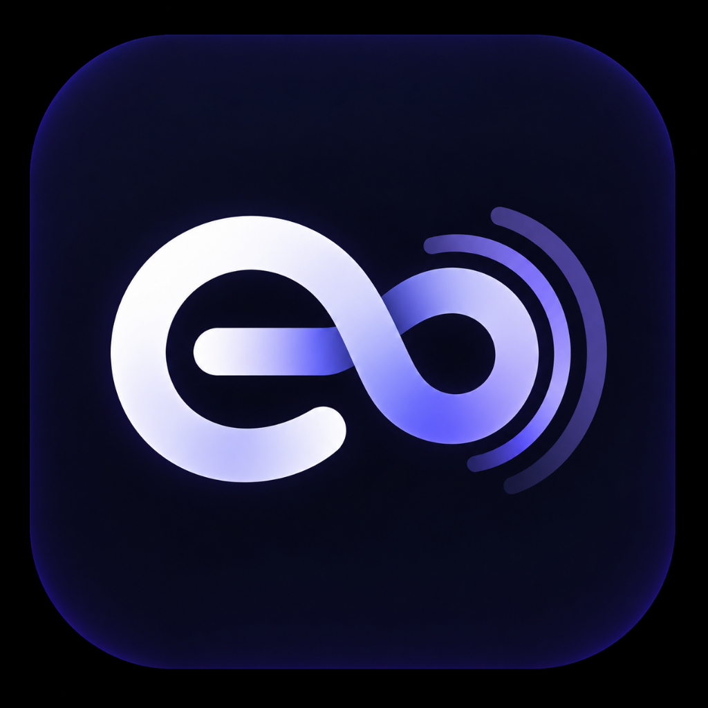

# EchoLoop ⚡

<p align="center">
  
</p>

<h3 align="center">Your second brain that follows through.</h3>

<p align="center">
  Speak your commitments naturally in any language. EchoLoop extracts the core action, schedules smart kickoffs, checks in autonomously, and holds you to your word.
</p>

<p align="center">
  
  
  
  
  
  
  
</p>

---

## ✨ Features

### 🎙️ Autonomous Voice-First Parsing
- Speak commitments in English, Malayalam, Hindi, Hinglish, Spanish, French, and code-switched dialects.
- Autonomous intent extraction via Google Gemini Flash: generates clear action items, extracts relative kickoff timestamps, and computes dynamic follow-up check-in delays.
- Serverless API endpoint (`/api/parse-voice`) with server-side Supabase JWT validation, sliding-window rate limiting, and structured proposals requiring confirmation before storage.

### ⏰ Real-Time Kickoff & Check-In Protocol
- **Strict 4-State Machine**: `PENDING` $\rightarrow$ `IN_PROGRESS` $\rightarrow$ `COMPLETED` / `SLIPPED`. Extensions increment `extensions_count` and reschedule kickoff back to `PENDING` with new reminders.
- **Kickoff Chime**: Audio prompts alert you when it's time to begin a scheduled goal.
- **Progress Tracking**: Move tasks to In-Flight, extend timers, or mark completions.
- **Follow-Up Verification**: Autonomous check-ins verify completion or handle slipped goals with rescheduling.

### 🔐 Supabase PostgreSQL & Auth with Row-Level Security (RLS)
- **Supabase Authentication**: Real sign-up, sign-in, and persistent JWT sessions with automatic profile provisioning.
- **Strict Row-Level Security**: Every table (`profiles`, `tasks`, `check_ins`, `reminders`, `wins`, `treats`) enforces user-isolated access (`auth.uid() = user_id`).
- **Child-Record Integrity**: Check-ins, reminders, and wins verify parent task ownership:
  ```sql
  EXISTS (SELECT 1 FROM public.tasks WHERE tasks.id = task_id AND tasks.user_id = auth.uid())
  ```
- **Isolated Demo Sandbox**: 1-click test access runs in an isolated client-side sandbox (`localStorage`), never writing to or touching production database tables.

### ☕ Accountability Circle & Treat Ledger
- Partner accountability board with live focus statuses and streaks.
- Send simulated treats and rewards (UPI, GPay, PhonePe, Cards) with celebratory confetti animations.
- Real-time in-app notification center.

### 🎨 Modern Light Aesthetic
- Clean pure white base theme with ambient electric indigo and violet radiant gradient glows matching the infinity audio brand logo.
- Responsive mobile & desktop glassmorphism with smooth micro-animations.
- Full PWA support with service worker caching and home-screen installability on Android & desktop.

---

## 🛠️ Architecture & Tech Stack

```
Vite SPA / PWA (React 19, TypeScript, Tailwind CSS v4)
   ├── Supabase Client (Auth & PostgreSQL with RLS)
   │     ├── public.profiles
   │     ├── public.tasks (16 domain fields)
   │     ├── public.check_ins
   │     ├── public.reminders
   │     ├── public.wins
   │     └── public.treats
   └── Vercel Serverless Function (/api/parse-voice.ts)
         ├── Server-side Supabase JWT Verification
         ├── Sliding-Window Rate Limiter
         └── Google Gemini 2.5 / 1.5 / 3.8 Flash Engine
```

---

## 🚀 Getting Started

### Prerequisites
- [Node.js](https://nodejs.org/) (v18 or higher recommended)
- A free [Supabase](https://supabase.com) account
- A free [Google AI Studio](https://aistudio.google.com/) Gemini API key

### 1. Clone the repository
```bash
git clone https://github.com/Kausthu7/echoloop.git
cd echoloop
```

### 2. Install dependencies
```bash
npm install
```

### 3. Initialize Supabase Database
1. Go to your [Supabase Dashboard](https://supabase.com/dashboard) $\rightarrow$ **SQL Editor**.
2. Copy and paste the contents of [`supabase/schema.sql`](supabase/schema.sql).
3. Click **Run** to provision all 6 tables, triggers, and Row-Level Security policies.

### 4. Configure Environment Variables
Create a `.env` file in the root directory:
```env
# Google Gemini API Key
GEMINI_API_KEY="your-gemini-api-key-here"

# Supabase Project Configuration
VITE_SUPABASE_URL="https://your-project-id.supabase.co"
VITE_SUPABASE_ANON_KEY="your-supabase-anon-key-here"
```

### 5. Start Local Development
```bash
npm run dev
```
Open [http://localhost:3000](http://localhost:3000) in your browser.

---

## ☁️ Deploying to Vercel

1. Push your repository to GitHub.
2. In the [Vercel Dashboard](https://vercel.com/new), import your `echoloop` repository.
3. Configure the following **Environment Variables** in project settings:
   - `GEMINI_API_KEY`: Your Google Gemini API key
   - `VITE_SUPABASE_URL`: Your Supabase Project URL
   - `VITE_SUPABASE_ANON_KEY`: Your Supabase Anon Key
4. Click **Deploy**. Vercel will automatically build the Vite SPA and deploy `/api/parse-voice` as a serverless function.

---

## 📦 Project Structure

```
├── api/
│   └── parse-voice.ts        # Vercel serverless voice parser with server-side auth & rate limiting
├── public/
│   ├── icon-192.png          # PWA icons
│   ├── icon-512.png
│   ├── manifest.json         # Web App Manifest
│   └── sw.js                 # Offline service worker
├── src/
│   ├── components/           # UI components (Header, ActionBoard, VoiceCaptureModal, AuthPage, etc.)
│   ├── lib/
│   │   └── supabase.ts       # Supabase client singleton & configuration check
│   ├── services/             # Supabase data services (Auth, Tasks, Wins, Treats, Reminders)
│   ├── types.ts              # Domain model definitions
│   └── App.tsx               # Main application orchestration & state machine
├── supabase/
│   └── schema.sql            # Complete PostgreSQL schema with RLS & triggers
├── vercel.json               # Vercel SPA routing & API rewrites
└── package.json
```

---

## 📄 License
MIT © EchoLoop